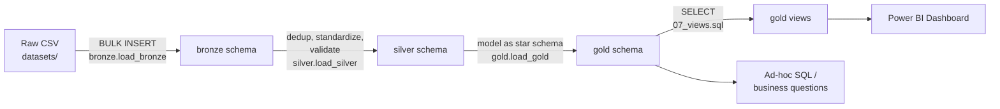

# Data Flow

End-to-end lineage for each entity, from source CSV to consumption. Use this to answer "where did this number come from?" during a walkthrough.

## Overall flow

## Table-by-table lineage

| Source CSV | Bronze | Silver | Gold |
|---|---|---|---|
| customers.csv | bronze.customers | silver.customers | gold.DimCustomer |
| accounts.csv | bronze.accounts | silver.accounts | gold.DimAccount |
| transactions.csv | bronze.transactions | silver.transactions | gold.FactTransactions |
| loans.csv | bronze.loans | silver.loans | gold.DimLoan + gold.FactLoans |
| complaints.csv | bronze.complaints | silver.complaints | gold.FactComplaints |
| branches.csv | bronze.branches | silver.branches | gold.DimBranch |
| *(generated, no source file)* | — | — | gold.DimDate |

## What happens at each hop

1. **CSV → Bronze** (`bronze.load_bronze`): `TRUNCATE` then `BULK INSERT`, `FIRSTROW = 2` to skip the header. No transformation — a load either succeeds row-for-row or fails outright.
2. **Bronze → Silver** (`silver.load_silver`): dedup via `ROW_NUMBER() OVER (PARTITION BY <natural key>)`, date parsing via `dbo.fn_ParseMessyDate`, name casing via `dbo.fn_ProperCase`, numeric casting via `TRY_CONVERT`, and validity flags (`is_email_valid`, `is_valid_account`, `is_interest_rate_valid`, `is_resolution_days_valid`) rather than deleting bad rows.
3. **Silver → Gold** (`gold.load_gold`): dimensions load first (customers, branches, accounts, loans, plus the pre-built `DimDate` calendar), then facts join back to the dimensions to pick up surrogate keys. `FactTransactions` is the only fact that excludes rows outright (where `is_valid_account = 0`) — see `docs/data_integration.md` for why.
4. **Gold → Views** (`07_views.sql`): four views pre-join and pre-aggregate the star schema into the shape each mart needs (see `docs/data_mart.md`).
5. **Gold/Views → Consumption**: Power BI connects to the views for the dashboard; `09_business_questions.sql` queries facts/dims/views directly for one-off analysis.

## Verifying the flow yourself

`scripts/checks/08_data_quality_checks.sql` (check #8) runs a row-count-by-layer query across all six entities in one shot — the fastest way to confirm nothing silently dropped or duplicated between bronze, silver, and gold.
