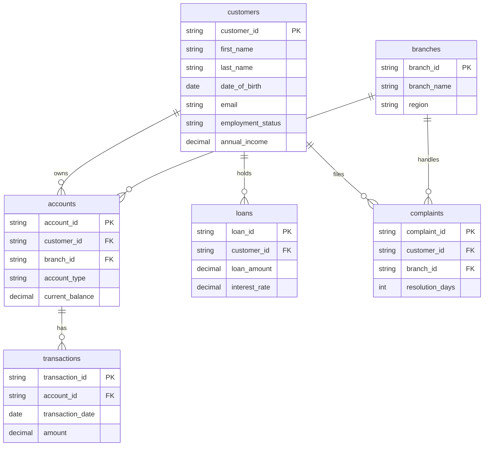

# Data Integration

## Purpose

This describes how the six source extracts relate to one another *before* they're reshaped into the gold star schema — i.e. the integration model that `silver.load_silver` relies on when joining across entities (e.g. validating that a transaction's `account_id` exists in accounts).

## Source entity relationships

## Integration points and how they're validated

| Relationship | Enforced how | What happens if it's broken |
|---|---|---|
| `accounts.customer_id` → `customers.customer_id` | Checked in `08_data_quality_checks.sql` (orphan account check) | Row is kept in silver, but flagged as orphaned; excluded from `DimAccount.CustomerKey` join in gold (NULL) |
| `transactions.account_id` → `accounts.account_id` | `silver.transactions.is_valid_account` flag, set during `silver.load_silver` | Row is kept in silver with the flag set to 0; **excluded** from `gold.FactTransactions` entirely |
| `loans.customer_id` → `customers.customer_id` | LEFT JOIN in `gold.load_gold`, no hard flag | `CustomerKey` is NULL in `FactLoans` if unmatched — loan is still loaded (loan amount is a hard business number, not something to drop) |
| `complaints.customer_id` / `complaints.branch_id` → `customers` / `branches` | LEFT JOIN in `gold.load_gold` | Same as above — `CustomerKey`/`BranchKey` NULL if unmatched, row is kept |

**Design choice:** transactions are the one entity where an invalid foreign key causes exclusion from gold, because a transaction that can't be tied to a real account is unusable for balance/volume reporting and would silently inflate totals if included. Loans and complaints are kept regardless, since the loan/complaint itself is still a real business event worth counting even if the customer link is broken — losing that count would understate risk/complaint volume.

## No real-time integration

All six sources are batch CSV extracts loaded via `BULK INSERT`. There's no streaming/CDC integration in this project — each pipeline run is a full refresh (`TRUNCATE` + reload), which fits a portfolio/demo dataset but wouldn't scale to a production bank's daily transaction volume without moving to incremental loads.
