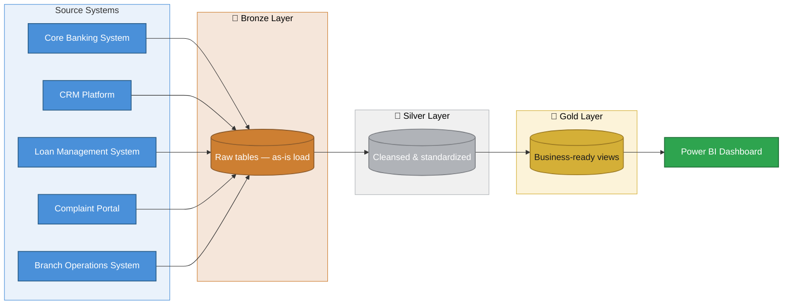
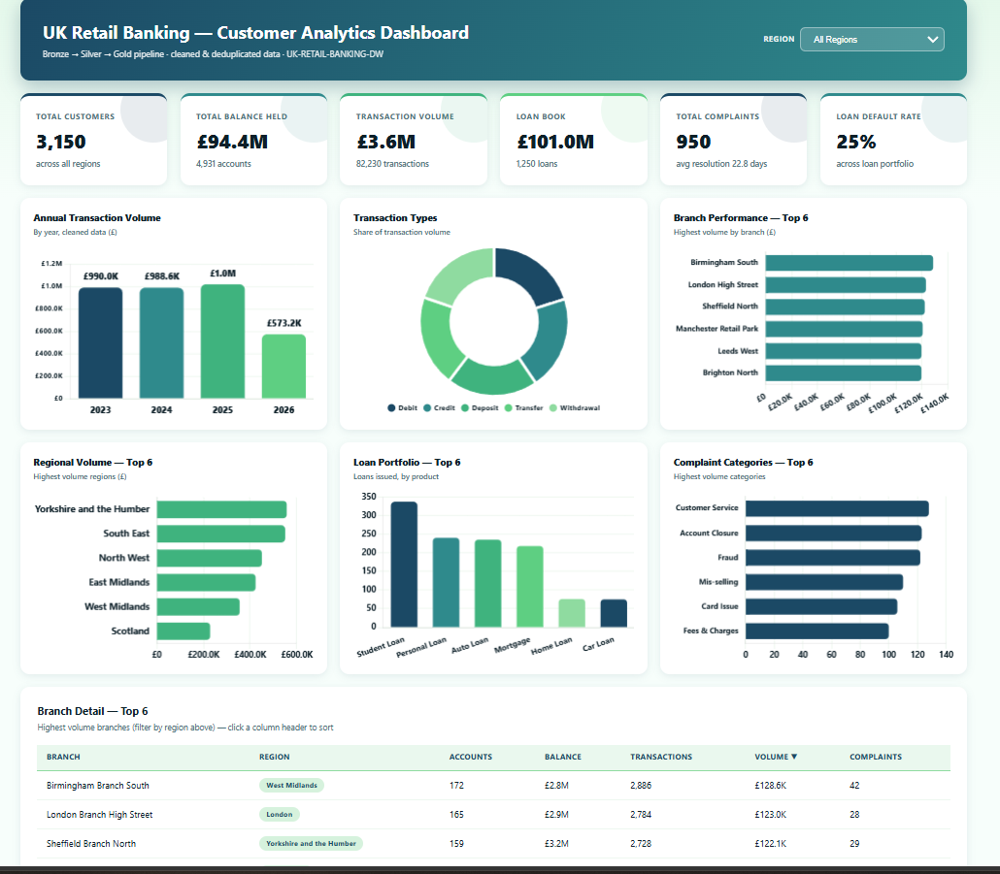

# UK Retail Banking Customer Analytics Data Warehouse

A portfolio data engineering & analytics project simulating the role of a data analyst hired by a UK retail bank to fix inconsistent reporting, resolve duplicated customer records, and deliver a single source of truth for KPIs across departments.

## 📌 Business Problem

Management at a UK retail bank has raised concerns that:
- Reports produced by different departments show inconsistent numbers
- Customer records are duplicated across source systems
- Key KPIs (active customers, account balances, loan performance, complaint resolution) vary depending on who is asked

This project builds a governed SQL Server data warehouse — following the **Medallion Architecture** (Bronze → Silver → Gold) — to clean, conform, and model data from five source systems into a single reliable analytics layer, ready for BI reporting.

## 🗂️ Source Systems

| Source System | Data |
|---|---|
| Core Banking System | Customers, Accounts |
| CRM Platform | Customer profile & contact data |
| Loan Management System | Loans |
| Customer Complaint Portal | Complaints |
| Branch Operations System | Branches |

## 📊 Datasets

Six raw CSV extracts, intentionally seeded with realistic data quality issues to simulate messy source-system exports:

| File | Rows | Key columns |
|---|---|---|
| `customers.csv` | ~3,166 | customer_id, first_name, last_name, gender, date_of_birth, email, phone_number, address, city, postcode, customer_since, employment_status, annual_income |
| `accounts.csv` | ~4,952 | account_id, customer_id, account_type, branch_id, open_date, account_status, current_balance |
| `transactions.csv` | ~106,576 | transaction_id, account_id, transaction_date, transaction_type, amount, merchant_name, transaction_channel |
| `loans.csv` | ~1,276 | loan_id, customer_id, loan_type, loan_amount, interest_rate, loan_start_date, loan_end_date, loan_status |
| `complaints.csv` | ~971 | complaint_id, customer_id, complaint_date, complaint_category, complaint_status, resolution_days, branch_id |
| `branches.csv` | ~33 | branch_id, branch_name, city, region, opening_date |

**Data quality issues simulated on purpose** (and resolved in the Silver layer):
- Mixed date formats in the same column (e.g. `02-Apr-1990`, `1977-05-28`, `14/07/2009`)
- Inconsistent text casing (e.g. `London` / `LONDON` / `london`)
- Inconsistent categorical values (e.g. `Withdrawal` / `Wdrl` / `DEBIT` / `Dbt`)
- Duplicate customer records
- Missing and invalid values

## 🏗️ Architecture



- **Bronze** — raw data loaded exactly as received, no transformations
- **Silver** — cleaned, deduplicated, standardized, and conformed data
- **Gold** — aggregated, business-ready views and stored procedures used to answer 20+ business questions

## 🧰 Tech Stack

- **SQL Server** (T-SQL) — data warehouse, ETL, views, stored procedures, data quality checks
- **Power BI** — dashboard and reporting layer

## 📁 Repository Structure

```
├── datasets/                          # Raw source CSVs
│   ├── customers.csv
│   ├── accounts.csv
│   ├── transactions.csv
│   ├── loans.csv
│   ├── complaints.csv
│   └── branches.csv
├── scripts/
│   ├── 00_init_database.sql           # Creates database + bronze/silver/gold schemas
│   ├── bronze/
│   │   ├── 01_ddl_bronze.sql          # Raw table DDL (6 tables, all NVARCHAR)
│   │   └── 02_load_bronze.sql         # bronze.load_bronze — BULK INSERT from CSVs
│   ├── silver/
│   │   ├── 03_ddl_silver.sql          # Cleansed table DDL + date/case helper functions
│   │   └── 04_load_silver.sql         # silver.load_silver — dedup, standardize, validate
│   ├── gold/
│   │   ├── 05_ddl_gold.sql            # Star schema: DimDate/Customer/Branch/Account/Loan + 3 facts
│   │   ├── 06_load_gold.sql           # gold.load_gold — builds DimDate, loads all dims/facts
│   │   └── 07_views.sql               # 4 reporting views for BI consumption
│   ├── checks/
│   │   └── 08_data_quality_checks.sql # Informational SELECTs — duplicate/missing/invalid counts
│   └── business_questions/
│       └── 09_business_questions.sql  # All 20 business questions as runnable SQL
├── docs/                               # Data catalog, data model diagrams
├── README.md
└── LICENSE
```

## ▶️ How to Use

1. Clone this repository
2. Run `scripts/00_init_database.sql` first — creates the database and schemas (⚠️ see warning in the script header)
3. Run `scripts/bronze/01_ddl_bronze.sql`, then `02_load_bronze.sql` (update the CSV file paths inside it first, or use SSMS's Import Flat File wizard if BULK INSERT can't see local files)
4. Run `scripts/silver/03_ddl_silver.sql`, then `04_load_silver.sql`
5. Run `scripts/gold/05_ddl_gold.sql`, then `06_load_gold.sql`, then `07_views.sql`
6. Run `scripts/checks/08_data_quality_checks.sql` to sanity-check row counts and data quality
7. Explore `scripts/business_questions/09_business_questions.sql` for the 20 business questions
8. Point Power BI at the gold-layer views/tables to build the dashboard

## 📈 Status

- ✅ Raw datasets generated
- ✅ Bronze / Silver / Gold SQL Server pipeline (views, stored procedures, data quality checks, 20 business questions)
- 🔄 Power BI dashboard — in progress

## 📄 License

This project is licensed under the MIT License — see [LICENSE](LICENSE) for details.


## Dashboard Preview



An interactive version (region filters, sortable tables, live tooltips) is available in [dashboard/uk_retail_banking_dashboard.html](dashboard/uk_retail_banking_dashboard.html) -- download and open it in any browser.
